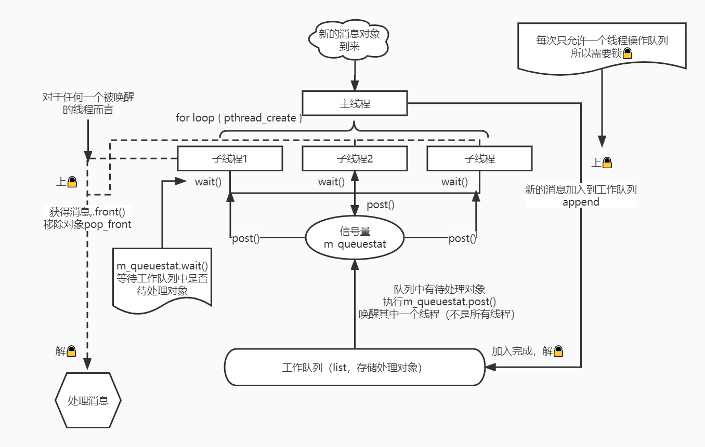

# 📚Docs

代码参考自《Linux高性能服务器编程》（游双）

💻usage：

```shell
$ ./http.out
```

📄文档还在生成中...

🍐webbench相关代码will comming soon...

## 模块介绍

🏊‍线程池：我们先抛开具体的http应用，单纯的从构造线程池的角度出发，这里http消息即我们要处理的对象，在C++当中，这就是一个模板类。以三个线程为例子：



1. 在主线程当中，我们循环构造thread_number个子线程，为了方便线程的回收，我们需要设置线程为可分离的（pthread_detach）。每个子线程执行woker函数，在worker函数内，负责处理未处理的消息对象。
2. 设置信号量，当工作队列中为空的时候，所有子线程（wait()）阻塞在信号量上，当有新消息到来的时候，主线程调用向工作队列增加一个待处理的消息对象，此时将信号量加1(post()，即V操作)。
3. 信号量值加1，此时会唤醒一个子线程（注意不是全部子线程），子线程不再阻塞，worker函数进而取出队列中的一个对象，并且调用该对象的process方法。

> 在每次操作消息队列的过程中，为了防止同步错误，即两个线程同时操作消息队列，每个线程在操作消息队列之前，我们都需要上锁，有关锁的代码封装在locker.h当中，在线程池这个类当中，我们使用了互斥锁进行线程之间的同步控制。

思考一下，我们这是一个Reactor的形式，使用同步IO，主线程只负责监听文件描述符上是否有事件发生。除此之外，主线程不做任何其他实质性上的工作。
